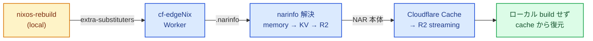
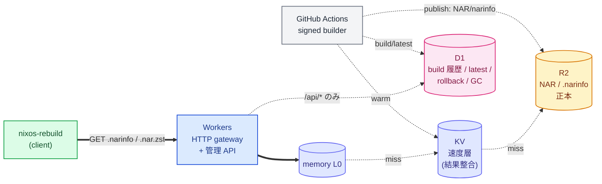

<div class="tag mb-6">下半期成果発表 / LT</div>

<div class="title-logos">
  
  <span class="title-logos-x">×</span>
  
</div>

# <span class="gradient-text">cf-edge</span><span class="nix-blue-text">Nix</span>

再現可能な NixOS 環境を、**すぐ使える** NixOS 環境にする
Cloudflare-native な Binary Cache 基盤

<div class="divider" style="max-width: 8rem; margin: 2rem 0 1.25rem 0"></div>

<div style="color: var(--c-text-dim); font-size: 0.85rem">権代颯士 — <span style="color: var(--c-text-mute)">@T4ko0522</span></div>

<!--
今日は自作の cf-edgeNix という個人プロジェクトの話をします。
これは Cloudflare ネイティブな NixOS の Binary Cache 基盤で、
ひとことで言うと「再現可能な NixOS 環境を、すぐ使える NixOS 環境にする」ためのものです。
前半で Nix と NixOS を軽く紹介して、後半で cf-edgeNix の中身を話します。
-->

---

<div class="section-label">01 — Agenda</div>

# 今日話すこと

- **Nix** とは — 軽く
- **NixOS** とは — 軽く
- **cf-edgeNix** — 本題。Cloudflare で作る NixOS の Binary Cache

前半は前提の説明、後半が本題です。

<!--
流れはシンプルで、まず Nix が何で、それを OS に広げた NixOS が何か、を 1 枚ずつ。
そこから本題の cf-edgeNix に入ります。
本題では「なぜ作ったか」「どう解決したか」「Cloudflare の各サービスをどう役割分担させたか」を話します。
-->

---
class: with-code-bg
---

<pre class="code-bg-pre">{
  description = "Reproducible NixOS configuration";

  inputs = {
    nixpkgs.url = "github:NixOS/nixpkgs/nixos-unstable";
    home-manager = {
      url = "github:nix-community/home-manager";
      inputs.nixpkgs.follows = "nixpkgs";
    };
  };

  outputs = { self, nixpkgs, home-manager, ... }: {
    nixosConfigurations.myhost = nixpkgs.lib.nixosSystem {
      system = "x86_64-linux";
      modules = [
        ./hosts/myhost/configuration.nix
        ./hosts/myhost/hardware-configuration.nix
        home-manager.nixosModules.home-manager
        {
          home-manager.useGlobalPkgs = true;
          home-manager.useUserPackages = true;
          home-manager.users.t4ko = import ./home/t4ko.nix;
        }
      ];
    };
  };
}</pre>

<div class="section-label">02 — 前提</div>


# Nix とは

ひとことで言うと **純粋関数型のパッケージマネージャ**。

「入力が同じなら出力も同じ」を徹底し、環境を**再現可能**にする。

<!--
Nix はひとことで言うと純粋関数型のパッケージマネージャ。
入力（依存）が同じなら出力（ビルド結果）も同じ、を徹底して環境を再現可能にする道具です。
ここはあっさり次にいきます。
-->

---
class: with-code-bg
---

<pre class="code-bg-pre"># Do not modify this file!  It was generated by 'nixos-generate-config'
# and may be overwritten by future invocations.  Please make changes
# to /etc/nixos/configuration.nix instead.
{
  config,
  lib,
  pkgs,
  modulesPath,
  ...
}: {
  imports = [
    (modulesPath + "/installer/scan/not-detected.nix")
  ];

  boot = {
    initrd.availableKernelModules = ["vmd" "xhci_pci" "ahci" "nvme" "usbhid" "usb_storage" "sd_mod"];
    initrd.kernelModules = [];
    kernelModules = ["kvm-intel"];
    extraModulePackages = [];
  };

  fileSystems."/" = {
    device = "/dev/disk/by-uuid/a874484f-5779-41c1-9881-d56293277620";
    fsType = "ext4";
  };

  fileSystems."/boot" = {
    device = "/dev/disk/by-uuid/C60B-B342";
    fsType = "vfat";
    options = ["fmask=0077" "dmask=0077"];
  };

  swapDevices = [];

  nixpkgs.hostPlatform = lib.mkDefault "x86_64-linux";
  hardware.cpu.intel.updateMicrocode = lib.mkDefault config.hardware.enableRedistributableFirmware;
}</pre>

<div class="section-label">03 — 前提</div>


# NixOS とは

Nix を **OS 全体に広げた** Linux ディストリビューション。

システム全体を**宣言的に管理**できる → 同じ設定からどこでも同じ OS が再現する。

<!--
NixOS は Nix の考え方を OS 全体に広げた Linux ディストリです。
システム全体を宣言的に管理できるので、同じ設定から同じ OS を再現しやすい。
前提はここまでで、ここから本題に入ります。
-->

---
class: nix-blue
---

<div class="section-label">04 — Motivation</div>

# 再現可能。でも、すぐ使えるとは限らない

NixOS は「**設定の再現性**」は高い。
でも「**すぐ使える状態までの再現性**」には課題がある。

<div class="annotation-note">注: <span class="annotation-code">nixos-rebuild</span> は、NixOS の設定を評価・ビルドして、現在のシステムへ反映する標準コマンド。</div>

- `nixos-rebuild` が遅い
- 初回構築時に大量の derivation がローカルでビルドされる
- cache miss するとローカル CPU に負荷がかかる
- マシン性能やネットワーク次第で復元体験が変わる

→ 同じ `configuration.nix` でも、環境が完成するまでに時間がかかる。

<!--
NixOS は「設定の再現性」はとても高いんですが、「すぐ使える状態までの再現性」には課題があります。
nixos-rebuild は NixOS の設定を評価・ビルドして、現在のシステムへ反映する標準コマンドです。
この nixos-rebuild が遅い、初回に大量の derivation がローカルでビルドされる、
cache miss するとローカル CPU が回り続ける、マシン性能やネットワーク次第で復元体験が変わる。
同じ configuration.nix でも、環境が完成するまでに時間がかかる、ということですね。
このギャップを埋めるのが cf-edgeNix です。
-->

---

<div class="section-label">05 — Concept</div>

# cf-edgeNix とは

**Cloudflare-native な NixOS Binary Cache 基盤。**

GitHub Actions でビルドした NixOS の system closure を、
Cloudflare（**R2 / KV / D1 / Workers**）上の global binary cache として配布する。

<div class="divider"></div>

似た立ち位置のサービスに **Cachix** などの SaaS 型 binary cache がある。cf-edgeNix の差別化点は:

- **Cloudflare 上に組み立てる self-hosted な edge cache** — 自分のアカウント・自分のドメイン
- **完全サーバーレス** — VM もコンテナも持たない。Workers / R2 / KV / D1 のマネージドサービスだけで成立
- **Nix 標準プロトコル準拠** — `nixos-rebuild` から `extra-substituters` に足すだけで使える

<!--
cf-edgeNix は Cloudflare ネイティブな NixOS Binary Cache 基盤です。
GitHub Actions で NixOS の system closure をビルドして、
その成果物を Cloudflare の R2 / KV / D1 / Workers の上に global binary cache として配置・配信する仕組みです。

立ち位置としては、Nix の世界には Cachix のような SaaS 型の binary cache サービスが既にあります。
ただ cf-edgeNix の差別化ポイントは 3 つあって、
1 つ目は「Cloudflare 上に自分で組み立てる self-hosted な edge cache」であること。
自分のアカウント・自分のドメイン・自分の料金プランで動かせるので、SaaS のアカウントや料金体系に縛られない。
2 つ目は「完全にサーバーレス」であること。VM もコンテナも持たず、Workers / R2 / KV / D1 のマネージドサービスだけで構成しています。
3 つ目は「Nix 標準プロトコル準拠」であること。クライアント側は extra-substituters に URL を 1 行足すだけで、専用ツールは要りません。
-->

---

<div class="section-label">06 — Client Config</div>

# クライアント設定

クライアント側は `extra-substituters` と公開鍵を足すだけ。

```nix
nix.settings = {
  extra-substituters     = [ "https://cf-edgenix.example.com" ];
  extra-trusted-public-keys = [ "cf-edgenix-1:xxxxxxxx=" ];
};
```

`nixos-rebuild` から見える挙動は標準の binary cache と同じ。
専用 CLI も追加パッケージもいらない。

<!--
substituters に Worker の URL を 1 行足して、trusted-public-keys に署名鍵の公開鍵を足すだけ。
クライアントから見える挙動は標準の binary cache とまったく同じで、専用 CLI も追加パッケージもいりません。
このあと、実際にクライアントが叩いたときに裏で何が起きるのかを見ます。
-->

---

<div class="section-label">07 — User Flow</div>

# ユーザーから見た binary cache の流れ

<div class="mermaid-fit">



</div>

<!--
ユーザー側、つまり nixos-rebuild する側から見ると、cf-edgeNix は普通の binary cache と全く同じに見えます。
nixos-rebuild が走ったときに、必要な store path の .narinfo を Worker に取りに行きます。
Worker 側は memory → KV → R2 の順で解決して、見つかったらクライアントに返す。
必要なら NAR 本体も Cloudflare Cache 経由で R2 から streaming で返します。
ローカルでは重いビルドを回さず、cache 経由で system closure を復元できます。
-->

---

<div class="section-label">08 — Architecture</div>

# 役割分担



> KV は真実ではなく、速い噂。真実は R2 と D1 に置く。 **D1 は read path に挟まない。**

<!--
一番のポイントは役割分担で、4 つのサービスに「正本 / 速度層 / control plane / 窓口」をきれいに分けています。
R2 が正本で、.narinfo と NAR 本体の最終的な真実をここに置く。
KV は速度層で、結果整合の "速い噂" 程度に扱う。KV は正本にしない。
D1 は control plane で、build 履歴・host ごとの latest pointer・rollback root・GC の live set を持つ。
Workers は窓口で、Nix client 向けの HTTP gateway と管理 API を出す。

ここで一番大事な設計判断が、read path に D1 を絶対に挟まないこと。
.narinfo の取得は memory → KV → R2 だけで完結させます。
なぜかというと、nixos-rebuild は一度に何百という .narinfo を引きにくるので、
もし KV miss で D1 に雪崩れ込ませると、D1 が control plane じゃなくて hot metadata server に転落してしまう。
だから "KV miss → R2 に直接落とす" と決め切っています。
spec の言い回しだと「KV は真実ではなく、速い噂。真実は R2 と D1 に置く」という分け方です。
-->

---

<div class="section-label">09 — Stack</div>

# 技術スタック

- **Cloudflare Workers** — エッジで動く HTTP gateway
- **R2 / KV / D1** — ストレージ・キャッシュ・DB
- **Hono + zod-openapi** — ルーティング / OpenAPI 自動生成
- **Drizzle ORM** — D1 のスキーマ・クエリ
- **TypeScript / Bun** — 実装・実行
- **vitest（workers-pool）** — unit / integration テスト

`nixos-rebuild` から直接叩ける標準の binary cache プロトコルに準拠。

<!--
技術スタックは Cloudflare をフルに使いつつ、上の層は型安全に寄せています。
Workers が HTTP gateway、R2 / KV / D1 がそれぞれストレージ・キャッシュ・DB。
Hono + zod-openapi で、Hono のルートと zod のスキーマから OpenAPI を自動生成。
Drizzle ORM で D1 のスキーマとクエリを TypeScript 側の型と合わせる。
実装は TypeScript / Bun、テストは vitest の workers-pool で実際の workerd 上で integration テストを回す。

ポイントは、これ全部が Nix 標準の binary cache プロトコルの上に乗っていて、
クライアント側に専用ツールを一切インストールさせないこと。
extra-substituters に URL を 1 行足すだけで使えます。
-->

---

<div class="section-label">10 — Summary</div>

# まとめ

- NixOS は「設定の再現性」は高いが「すぐ使えるまで」が遅い
- cf-edgeNix は CI で事前ビルド → Cloudflare で配布してそれを解決
- Cachix のような SaaS とは違い、**自分の Cloudflare 上に self-host する完全サーバーレス構成**
- R2 / KV / D1 / Workers を役割分担させた edge-native な設計

> 再現可能な NixOS 環境を、すぐ使える NixOS 環境に。

<!--
まとめると、NixOS は「設定の再現性」は高いけれど「すぐ使えるまでが遅い」。
cf-edgeNix はそこを、CI で事前にビルドして Cloudflare で配布することで解決します。
Cachix のような SaaS 型の binary cache と違って、自分の Cloudflare アカウントの上に self-host する、
完全サーバーレスの edge cache だ、というのが特徴です。
役割分担は R2 が正本、KV が速度層、D1 が control plane、Workers が窓口で、
read path に D1 を挟まないという edge-native な設計に振り切っている。
狙いは一貫していて、「再現可能な NixOS 環境を、すぐ使える NixOS 環境にする」ことです。
-->

---
layout: center
---

# <span class="gradient-text">ありがとうございました</span>

<div class="divider" style="max-width: 8rem; margin: 1.5rem auto 2rem auto"></div>

<div style="color: var(--c-text-dim); font-size: 0.9rem; line-height: 2">
github.com/t4ko0522/cf-edgeNix<br/>
<span style="color: var(--c-text-mute)">@T4ko0522 ／ t4ko.vercel.app</span>
</div>

<!--
以上で発表を終わります。ありがとうございました。
-->
